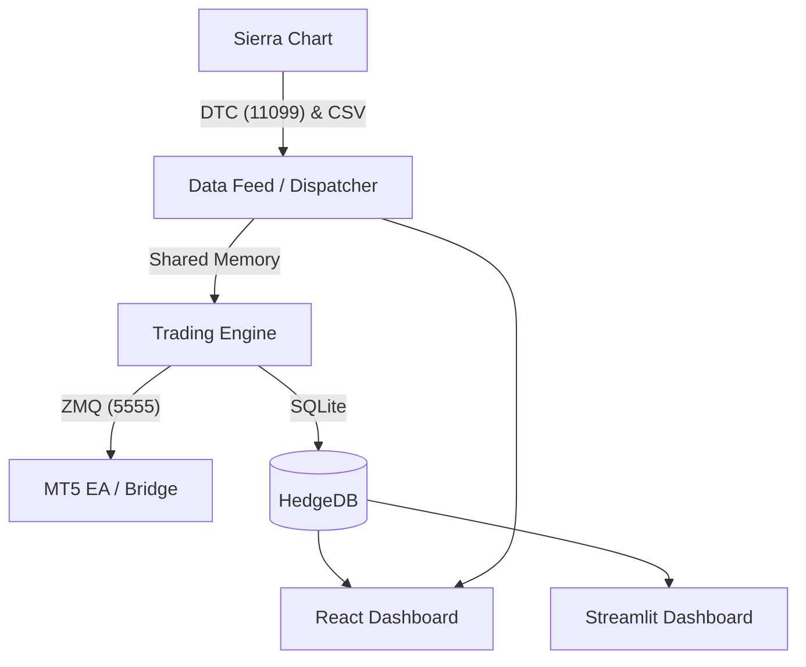

# Hedge Trading System (v5.5)

An institutional-grade quantitative trading platform designed for high-performance XAUUSD execution. This system integrates Sierra Chart (DTC Protocol) for ultra-low latency market data and MetaTrader 5 for robust trade execution.

## 🚀 Core Features
- **Ultra-Low Latency**: Direct DTC Protocol integration using Binary VLS encoding.
- **Dual Execution**: Seamless MT5 Bridge for trade handling and account synchronization.
- **Advanced Alpha**: Multi-TF CVD Slope, Fractal Zone Engines, and Adaptive Delta Logic.
- **Institutional Risk**: Integrated Kelly Criterion, Monte Carlo Drawdown Simulation, and Spread Veto.
- **Pro Dashboards**: Choice of **Modern React (Next.js)** for professional monitoring or **Streamlit** for rapid data analysis.
- **Precise Delta**: High-precision footprint mapping from Sierra Chart study columns (18, 25, 26).

## 📂 System Architecture

## 🛠 Installation & Setup
1. **DTC Server**: In Sierra Chart, go to `Global Settings -> DTC Server Settings`. Set to `Binary VLS` and `Local Computer Only`.
2. **Database**: Initialize the system with `python scripts/init_db.py`.
3. **Execution**: Deploy `HedgeEA.mq5` to your MT5 terminal. Ensure `libzmq.dll` and `libsodium.dll` are in `MQL5/Libraries`.
4. **Environment**: Configure `.env` with your symbol (e.g., `XAUUSD[M]`) and port settings.
5. **UI (React)**: Run `npm install` inside `dashboard-react` to set up the professional dashboard.

## 📖 Documentation
Detailed technical guides are available in the project files:
- **[DTC Protocol Guide](docs/DTC_PROTOCOL_GUIDE.md)**: Packet structures, handshakes, and troubleshooting.
- **[System Roadmap](tests/docs/system_documentation.md#roadmap)**: Upcoming features and development phases.
- **[MT5 Installation Guide](tests/docs/MT5_INSTALLATION_CHECKLIST.md)**: Step-by-step MT5/EA setup.
- **[React Setup Guide](REACT_SETUP_GUIDE.md)**: Getting started with the Next.js dashboard.
- **[Expert Review](tests/docs/expert_panel_review_v5.3.md)**: Performance analysis and risk audit.

## ⚖️ License
Proprietary / Institutional Use Only.