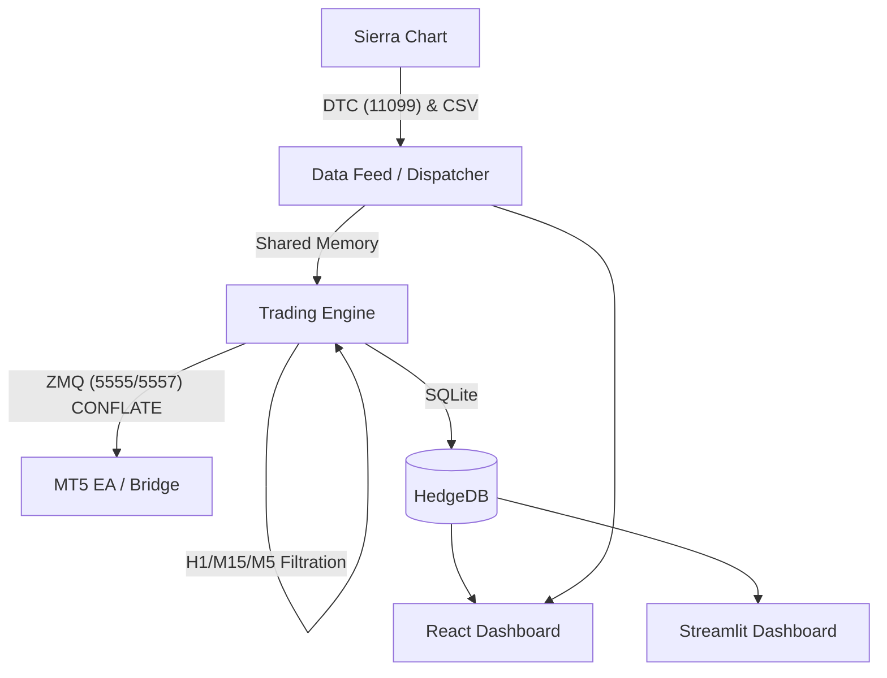

# Institutional Gold (XAUUSD) Trading Stack (v6.0.0)

An institutional-grade quantitative trading platform designed for high-performance XAUUSD execution. This system integrates Sierra Chart (DTC Protocol) for ultra-low latency market data and MetaTrader 5 for robust trade execution.

## 🚀 Core Features (v6.0.0)
- **Ultra-Low Latency**: Direct DTC Protocol integration using Binary VLS encoding for sub-millisecond data processing.
- **ZMQ CONFLATE**: Zero-drift market data tunnel ensuring 0ms queue latency for real-time execution.
- **Triple-TF Alignment**: Mandatory hierarchical filtration (H1 Bias -> M15 Zone -> M5 Trigger).
- **Stress Testing Site**: Professional React and Streamlit interfaces for Monte Carlo simulations.
- **IGOF Intelligence**: Integrated Gold Order Flow (IGOF) filtration system with Correlation and Liquidity engines.
- **Dual Execution**: Seamless MT5 Bridge for institutional trade handling and account synchronization.
- **Advanced Alpha**: Multi-TF CVD Slope, Fractal Zone Engines, and Adaptive Delta Logic (FLIP/SURGE signals).
- **Institutional Risk**: Integrated Kelly Criterion, Monte Carlo Drawdown Simulation, and Spread Veto.
- **Pro Dashboards**: Choice of **Modern React (Next.js)** for professional monitoring or **Streamlit** for rapid data analysis.

## 📂 System Architecture

## 🛠 Installation & Setup
1. **DTC Server**: In Sierra Chart, go to `Global Settings -> DTC Server Settings`. Set to `Binary VLS` and `Local Computer Only`.
2. **Database**: Initialize the system with `python scripts/init_db.py`.
3. **Execution**: Deploy `HedgeEA.mq5` to your MT5 terminal. Ensure `libzmq.dll` and `libsodium.dll` are in `MQL5/Libraries`.
4. **Environment**: Configure `.env` with your symbol (e.g., `XAUUSD[M]`) and port settings.
5. **UI (React)**: Run `npm install` inside `dashboard-react` to set up the professional dashboard.

## 📖 Key Documentation
- **[GitHub Setup Guide](GITHUB_SETUP.md)**: Security and repository management.
- **[DTC Protocol Guide](docs/DTC_PROTOCOL_GUIDE.md)**: Packet structures and handshakes.
- **[System Ready MD](SYSTEM_READY.md)**: Final verification checklist for live deployment.
- **[Master Strategy Spec](docs/MASTER_STRATEGY_SPEC.md)**: Unified H1/M15/M5 logic.
- **[React Setup Guide](REACT_SETUP_GUIDE.md)**: Getting started with the Next.js dashboard.
- **[Troubleshooting](TROUBLESHOOTING.md)**: Common issues and fixes.

## ⚖️ License
Proprietary / Institutional Use Only.