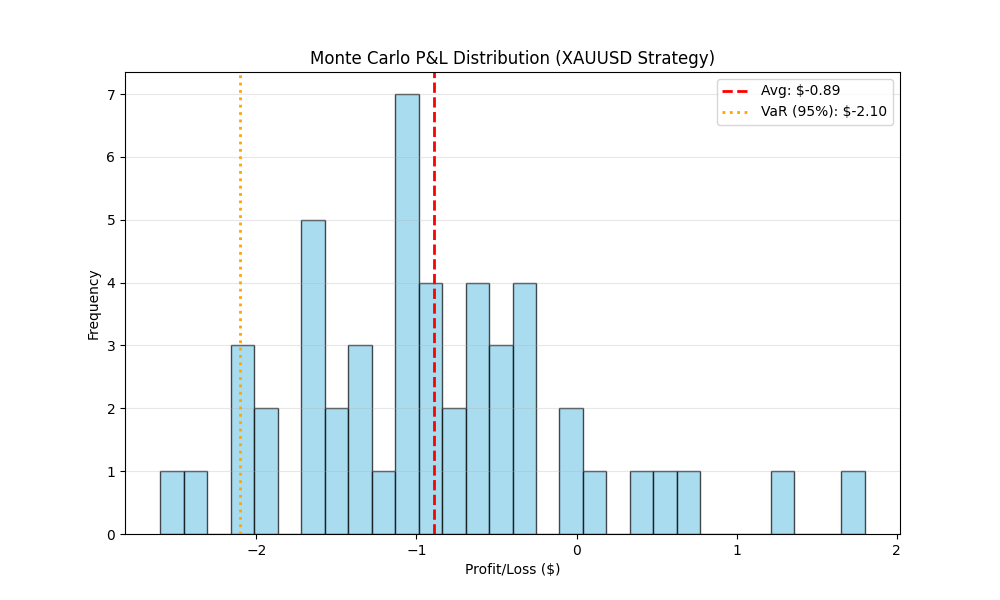

# Monte Carlo Simulation Report
Generated: 2026-02-15 21:40:12
Asset: XAUUSD | Balance: $100

## Executive Summary
- **Total Iterations:** 50
- **Avg Profit / Week:** $-0.89
- **Avg Win Rate:** 19.81%
- **Avg Trades / Week:** 41.64

## Risk Metrics
- **Value at Risk (95%):** $-2.10
- **Probability of Ruin (>1% Weekly DD):** 44.00%

## Visual Distribution

## Veto Analysis
| Filter | Rejections |
| :--- | :--- |
| Filter One (Bias) | 13415 |
| Filter Two (Zones) | 4424 |
| Candlestick | 45041 |
| CRO Audit | 0 |

---
*Raw Data: [mc_results_parity.csv](mc_results_parity.csv)*
