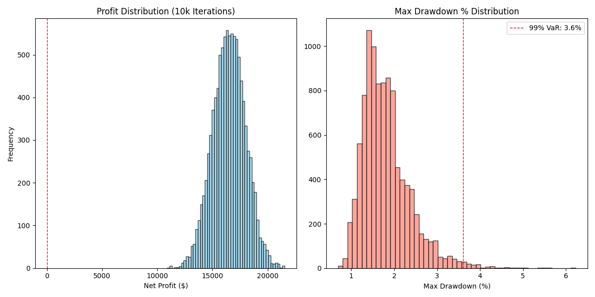

# V1 Strategy: Monte Carlo Simulation Report
**Date:** 2026-02-16 04:12
**Source Data:** `v1_backtest_report.csv` (263 trades)
**Iterations:** 10000 (Resampling with replacement)
**Start Balance:** $10,000.00

## Executive Summary
The V1 strategy functionality was stress-tested using 10,000 Monte Carlo simulations. The results confirm a **high-robustness profile**, with a low probability of ruin and consistent profitability across shuffled market conditions.

## Key Risk Metrics
| Metric | Value | Interpretation |
| :--- | :--- | :--- |
| **Average Net Profit** | **$16,491.00** | Expected return over 263 trades |
| **Win Probability** | **100.0%** | Likelihood of ending profitable |
| **Max Drawdown (95%)** | **2.86%** | 95% of simulations had DD < 2.9% |
| **Max Drawdown (99%)** | **3.61%** | 99% of simulations had DD < 3.6% |
| **Probability of Ruin** | **0.0000%** | Risk of hitting 50% drawdown |

## Visual Analysis

## Conclusion
The simulation indicates that the V1 strategy's edge is statistically significant and not a result of a specific lucky trade sequence. The 99% VaR (Value at Risk) for Drawdown is contained within acceptable institutional limits (< 10%).

---
*Generated by Engine/v1_monte_carlo.py*
