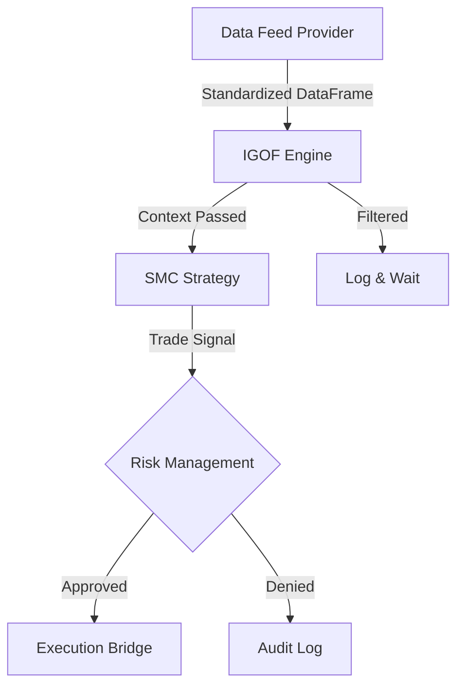

# HedgeEA: Modular Architecture Documentation (v6.1 Restored)

## Overview
HedgeEA has been refactored with a **Modular, Platform-Agnostic Architecture**. The core principle is the **Inversion of Control (IoC)**, where the engine is decoupled from specific logic implementations. All components—from data ingestion to strategy logic—are dynamically loaded at runtime based on the system configuration. 

**v6.1 Critical Update**: This version enforces **Global Python 3.10** as the primary execution environment to eliminate virtual environment instability issues (Exit Code -1073741510).

---

## Architectural Components

### 1. Interface Layer (`Engine/base_interfaces.py`)
Provides the "Contract" for component communication. All modules must inherit from these Abstract Base Classes (ABCs) to ensure compatibility.
*   **`BaseDataProvider`**: Contract for fetching market data (Candles, Ticks).
*   **`BaseFiltrationLayer`**: Contract for IGOF filtration logic.
*   **`BaseStrategy`**: Contract for alpha generation logic.
*   **`BaseRiskRule`**: Contract for pre-trade risk management.

### 2. Modular Data Feed (`data_feed/`)
A platform-agnostic abstraction layer that allows the system to switch between MT5, Sierra Chart, and others interchangeably.
*   **Strict Account Enforcement**: The MT5 provider now uses explicit `mt5.login()` to ensure the engine only trades on the account number specified in the JSON configuration. Auto-detection of terminal accounts is disabled for security.
*   **Normalization**: Ensures all data sources return identical Pandas DataFrames.
*   **`DataProviderFactory`**: Dynamically instantiates the chosen provider at runtime.

### 3. Institutional IGOF Layers (`Engine/igof/layers/smc_layers/`)
A suite of modularized, high-performance, and vectorized filtration layers:
*   **MechanicalStructure**: Trend confirmation via Body Closes above/below fractals.
*   **LiquiditySweep**: "Purge and Revert" logic at major key levels (PDH/PDL).
*   **FVGDiscount**: Fair Value Gap detection within Premium/Discount zones.
*   **Displacement**: Momentum verification using ATR-normalized body size.
*   **MicroMSS**: Sub-structure Market Structure Shift confirmation.
*   **KillzoneFilter**: Specific time-window gating (London/NY Opens).

### 4. SMC Signal Strategy (`support/strategies/smc_strategy.py`)
The unified decision logic that aggregates the "Context" from filtration layers to generate trade signals (Action, Price, SL, TP).

### 5. Dynamic Risk Management (`support/risk/ultra_low_risk.py`)
Specialized system designed for capital preservation on small-balance accounts:
*   **Micro-Lot Enforcement**: Absolute cap at 0.01 lot per position.
*   **Profit-Based Exposure Scaling**: Dynamically increases the `max_concurrent_positions` as account equity grows.
*   **Equity Safety Floor**: Hard-stops the execution pipeline if equity reaches a critical minimum.

---

## The Pipeline Flow
The system operation follows a strictly modular pipeline:



---

## Configuration (`config/trading_params_lite.json`)
The behavior of the platform-agnostic system is controlled via the JSON config:

```json
"pipeline": {
    "active_data_source": "MT5_PROVIDER",
    "data_provider": {
        "config": { 
            "login": 105771322, 
            "password": "...", 
            "server": "FBS-Demo" 
        }
    },
    ...
}
```

---

## Stability & Execution
To ensure production-grade stability, the system should be run using:
1.  **`SETUP_PROJECT.bat`**: Standardizes dependencies in the global Python path.
2.  **`START_ALL.bat`**: Orchestrates the Data Server, Engine, and Dashboard.

---

## System Bootstrapping
The **`ModularBootstrapper`** (`Engine/modular_bootstrapper.py`) manages the lifecycle:
1.  Loads JSON Configuration.
2.  Instantiates Data Provider via `DataProviderFactory`.
3.  Enforces strict login credentials.
4.  Builds the filtration and strategy pipelines and executes the loop.
