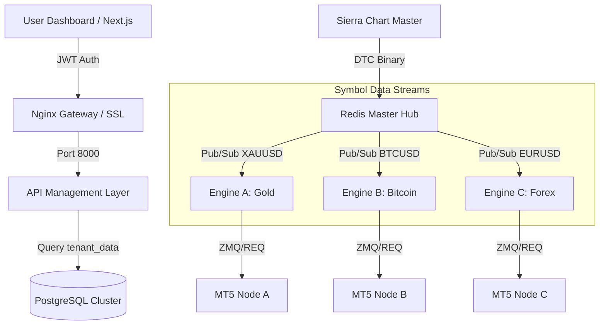

# 🏗️ Master Scaling Specification: Multi-Asset Server-Based Platform

This document provides a detailed technical blueprint for transforming the local XAUUSD workstation into a centralized, server-based **Multi-Asset** "Trading-as-a-Service" (TaaS) platform.

---

## 🗺️ Visual Architecture: Distributed Multi-Asset Stack



---

## 🏛️ 1. Infrastructure & Asset Orchestration
To handle multiple assets (XAUUSD, BTCUSD, etc.) concurrently across different users:

### Hardware Specification (Minimum for 10-20 Multi-Asset Users)
| Component | Specification | Purpose |
| :--- | :--- | :--- |
| **Primary Server** | Ubuntu 22.04 LTS (32 vCPU, 64GB RAM) | Hosting Docker, Redis Hub, and Multi-Asset Engine Cluster. |
| **Execution Nodes** | Windows Server 2022 (8 vCPU per node) | Hosting specialized MT5 groups for different asset classes. |
| **Database** | Managed PostgreSQL (RDS) | Global state for all users and all assets. |

### Multi-Asset Container Stack
- `gateway-nginx`: SSL Termination & Asset Routing.
- `master-hub`: The **Cross-Asset** DTC Ingestor.
- `engine-instance-[USER]-[SYMBOL]`: A dedicated Docker container per user/asset pair (e.g., `user1-gold`, `user1-btc`).

---

## 📡 2. Cross-Asset Data Architecture (Redis Pub/Sub)
The system no longer broadcasts to a single channel. It utilizes a **Dynamic Channel Mapping** system.

### The Multi-Asset Broadcaster
```python
# master-hub/redis_broadcaster.py
def broadcast_market_data(symbol, data):
    # Dynamically route to symbol-specific channels
    channel = f"market_data:{symbol}"
    r.publish(channel, json.dumps(data))
    # Update global health heartbeat
    r.set(f"health:last_tick:{symbol}", time.time())
```

### The Asset-Specific Subscriber
```python
# Engine/main_loop.py
target_symbol = os.getenv("TRADING_SYMBOL", "XAUUSD")
pubsub.subscribe(f"market_data:{target_symbol}")
```

---

## ⚡ 3. Execution: Multi-Asset Remote Bridge
Different assets often require different brokers or specialized MT5 account groups.

### Remote Proxy Routing
- **ZMQ Bridge**: The signal includes an `asset_tag` to ensure it arrives at the correct MT5 node.
- **Symbol Normalization**: The Bridge translates internal symbols (e.g., `GOLD`) to broker-specific symbols (e.g., `XAUUSD_m`).

---

## 📂 4. Multi-Tenant Folder Structure
```text
/opt/hedge-platform/
├── .env.production
├── docker-compose.yml
├── configs/
│   ├── symbols.json        # Global list of supported assets
│   └── brokers.json        # Mapping of symbols to remote MT5 IPs
├── master-hub/             # The Cross-Asset Controller
├── engine/                 # Reusable Trading Logic Container
└── ...
```

---

## ⚙️ 5. Multi-Asset Environment Registry
| Variable | Example | Goal |
| :--- | :--- | :--- |
| `TRADING_SYMBOL` | `BTCUSD` | Defines which asset this instance trades. |
| `MT5_HOST` | `10.0.0.5` | Routes to the specific MT5 node for that asset. |
| `RISK_SETTING` | `Conservative` | Asset-specific risk profiles (Gold vs Crypto). |

---

## 🛠️ Infrastructure Stability (v6.1 Milestone)
The system has standardized on **Global Python 3.10** to solve environment-level crashes.
- **Portability**: Verified setup via `SETUP_PROJECT.bat`.
- **Reliability**: Decoupled from fragile virtual environments.

---
*End of Multi-Asset Master Scaling Specification v1.2 (v6.1 Hardened)*
