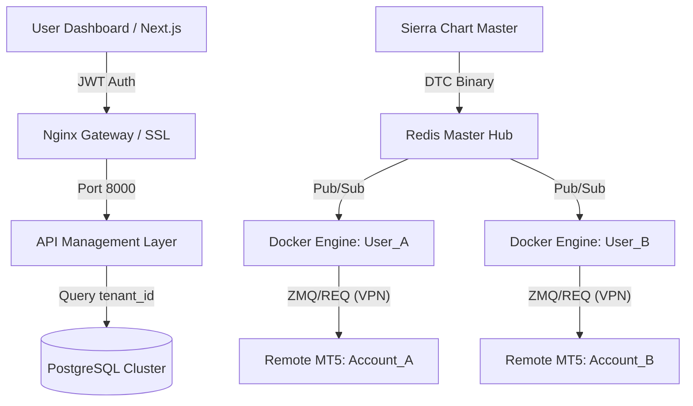

# 🏗️ Master Scaling Specification: Server-Based Multi-User Platform

This document provides a detailed technical blueprint for transforming the local XAUUSD workstation into a centralized, server-based "Trading-as-a-Service" (TaaS) platform.

---

## 🗺️ Visual Architecture: Distributed Multi-Tenant Stack



---

## 🏛️ 1. Orchestration & Infrastructure Stack
To handle multiple users reliably, you must transition to a **Cloud-Native Cluster**.

### Hardware Specification (Minimum for 10-20 Users)
| Component | Specification | Purpose |
| :--- | :--- | :--- |
| **Primary Server** | Ubuntu 22.04 LTS (16 vCPU, 32GB RAM) | Hosting Docker, Redis, and Web API. |
| **Execution Nodes** | Windows Server 2022 (4 vCPU, 8GB RAM per 5 users) | Hosting MT5 Terminals. |
| **Database** | Managed PostgreSQL (RDS or equivalent) | Storing user data, settings, and trades. |

### The Container Stack
Every component must be containerized to allow **Horizontal Scaling**:
- `gateway-nginx`: Round-robin load balancer.
- `api-service`: Central FastAPI backend (Multi-tenant).
- `data-broadcast`: Redis-based real-time feed distribution.
- `engine-instance-[USER_ID]`: A dedicated Python Trading Engine container per user.

---

## 📡 2. Centralized Data Architecture (DTC Master)
You no longer connect every user to Sierra Chart. Instead, you use a **Publish-Subscribe (Pub/Sub)** model.

### The Data Master Server
1.  **Ingestion**: Running `server.py` on the Primary Server connecting directly to Sierra Chart via DTC.
2.  **Broadcasting**: Instead of saving to Shared Memory, the Master broadcasts to a **Redis Channel**.
    *   `CHANNEL: "MARKET_DATA:XAUUSD"`
3.  **Consumption**: User Engine containers subscribe to the Redis channel. This reduces the load on Sierra Chart to exactly **ONE** connection regardless of how many users you have.

---

## 🔐 3. Multi-Tenancy & Security Matrix
This is the most critical change for a multi-user environment.

### JWT Authentication Flow
1.  **Login**: User logs in to the React Dashboard.
2.  **Token**: Server issues a JSON Web Token (JWT) signed with a `SECRET_KEY`.
3.  **Validation**: All subsequent API calls to `/ohlc`, `/settings`, or `/signals` must include this token.

### Database Schema (PostgreSQL)
```sql
CREATE TABLE users (id SERIAL PRIMARY KEY, username TEXT, secret_key TEXT);
CREATE TABLE profiles (user_id INT, trading_symbol TEXT, risk_pct FLOAT, ...);
CREATE TABLE trades (id SERIAL PRIMARY KEY, user_id INT, ticket_id INT, ...);
```
**CRITICAL**: Every database query MUST filter by `user_id = CURRENT_USER`.

---

## ⚡ 4. Execution: Remote MT5 Proxy Cluster
Since MT5 is Windows-based, you use a **Proxy Bridge** architecture.

### Remote execution Flow
1.  **Signal Gen**: User A's Engine (Docker) generates a signal.
2.  **ZMQ Bridge**: The signal is sent via **ZeroMQ (ZMQ_PUB)** to a specific IP/Port assigned to that user's MT5.
3.  **Execution**: The MT5 EA on the Remote Windows VPS receives the signal and executes.
4.  **Network Security**: You *must* use a **VPN (WireGuard)** or **SSH Tunnel** to ensure ZMQ traffic between the Linux Cloud Server and the Windows MT5 VPS is encrypted.

---

## 🗺️ 5. Step-by-Step Deployment Guide

### Step 1: Initialize the API Gateway (Nginx)
```bash
# Example nginx config for routing
server {
    listen 80;
    server_name trading.yourfirm.com;
    location / {
        proxy_pass http://localhost:3000; # Next.js Dashboard
    }
    location /api/ {
        proxy_pass http://localhost:8000; # FastAPI Backend
    }
}
```

### Step 2: Set up the Docker Cluster
Create a `docker-compose.yml` to launch the core services.
```yaml
services:
  db:
    image: postgres:15
    environment:
      POSTGRES_DB: hedge_fund_db
  redis:
    image: redis:7-alpine
  dashboard:
    build: ./dashboard-react
    ports: ["3000:3000"]
```

### Step 3: Launch Dedicated Engine Instances
When a user "activates" their engine, your platform runs:
```bash
docker run -d --name engine-user-123 \
  -e USER_ID=123 \
  -e MT5_HOST="remote-vps-ip" \
  -e REDIS_URL="redis://db-server" \
  trading-engine:latest
```

---

## 🛠️ 6. Core Implementation Snippets

### A. The Universal Engine Dockerfile
This ensures a consistent environment for every user instance.
```dockerfile
FROM python:3.10-slim
WORKDIR /app
COPY requirements.txt .
RUN pip install --no-cache-dir -r requirements.txt
COPY . .
# Use environment variables to target specific user config
CMD ["python", "Engine/main_loop.py"]
```

### B. Redis Data Broadcaster (The Hub)
Add this to `master-hub/redis_broadcaster.py` to distribute DTC data:
```python
import redis
import json

r = redis.Redis(host='localhost', port=6379, db=0)

def broadcast_market_data(symbol, data):
    """Data received from DTC is pushed to a Redis channel"""
    channel = f"market_data:{symbol}"
    r.publish(channel, json.dumps(data))
```

### C. Engine Subscriber (The Client)
Update `Engine/main_loop.py` to consume from Redis:
```python
import redis
import json

pubsub = r.pubsub()
pubsub.subscribe("market_data:XAUUSD")

for message in pubsub.listen():
    if message['type'] == 'message':
        tick_data = json.loads(message['data'])
        # Process tick_data for strategy analysis
```

### D. User Provisioning Script (`onboard_user.sh`)
Automate the deployment of a new trading engine instance.
```bash
#!/bin/bash
USER_ID=$1
MT5_HOST=$2
SYMBOL=$3

if [ -z "$USER_ID" ]; then
  echo "Usage: ./onboard_user.sh <USER_ID> <MT5_HOST> <SYMBOL>"
  exit 1
fi

echo "Spinning up Engine for User: $USER_ID on $MT5_HOST for $SYMBOL..."

docker run -d \
  --name "engine-instance-$USER_ID" \
  --restart always \
  -e USER_ID="$USER_ID" \
  -e MT5_HOST="$MT5_HOST" \
  -e TRADING_SYMBOL="$SYMBOL" \
  -e REDIS_URL="redis://redis-hub:6379" \
  -e DATABASE_URL="postgresql://user:pass@db:5432/hedge" \
  trading-engine:latest
```

### E. Server Health Monitor (`diag_server.py`)
Run this on the master server to detect data lag or memory spikes.
```python
import redis
import psutil
import time

r = redis.Redis(host='localhost', port=6379, db=0)

def monitor():
    while True:
        # Check Redis Data Flow
        last_tick = r.get("last_tick_timestamp")
        age = time.time() - float(last_tick) if last_tick else 999
        
        # Check System Load
        cpu = psutil.cpu_percent()
        mem = psutil.virtual_memory().percent
        
        print(f"[HEALTH] Lag: {age:.2f}s | CPU: {cpu}% | RAM: {mem}%")
        
        if age > 5:
            print("[CRITICAL] Data Feed Lag Detected!")
            
        time.sleep(10)

if __name__ == "__main__":
    monitor()
```

### F. Multi-tenant API (FastAPI Auth Wrapper)
```python
from fastapi import Depends, HTTPException, status
from fastapi.security import OAuth2PasswordBearer

oauth2_scheme = OAuth2PasswordBearer(tokenUrl="token")

async def get_current_user_id(token: str = Depends(oauth2_scheme)):
    # Verify JWT and extract user_id
    user_id = verify_jwt(token)
    if not user_id:
        raise HTTPException(status_code=401, detail="Invalid token")
    return user_id

@app.get("/ohlc")
async def get_ohlc(tf: str, user_id: int = Depends(get_current_user_id)):
    # Data is SHARABLE (Market Data), but settings are PRIVATE
    return fetch_data_from_redis(tf)
```

---

## 📂 7. Target Server Directory Structure
To maintain an institutional-grade codebase, organize the server as follows:

```text
/opt/hedge-platform/
├── .env.production         # Global Server Secrets
├── docker-compose.yml       # Primary Orchestration
├── scripts/                # Automation & Maintenance
│   ├── onboard_user.sh     # User Provisioning Script
│   └── diag_server.py      # Health Monitoring
├── gateway/                # Nginx & SSL Configs
│   └── nginx.conf
├── master-hub/             # Central Data Distribution
│   ├── server.py           # DTC Master Ingestor
│   └── redis_broadcaster.py
├── engine/                 # Trading Engine (Docker Base)
│   ├── Dockerfile
│   ├── main_loop.py
│   └── requirements.txt
├── api/                    # FastAPI Multi-tenant Layer
│   ├── main.py
│   ├── auth.py
│   └── models.py
└── dashboard/              # Next.js Dashboard
    ├── Dockerfile
    └── public/
```

## ⚙️ 8. Essential Environment Variables (.env)
Every user instance will require these variables to function in isolation:

| Variable | Example | Goal |
| :--- | :--- | :--- |
| `DATABASE_URL` | `postgresql://user:pass@db:5432/hedge` | Shared Multi-tenant DB. |
| `REDIS_URL` | `redis://redis-hub:6379` | Data Feed Subscription. |
| `JWT_SECRET` | `32-char-random-string` | Backend Security. |
| `BRIDGE_REQ_PORT` | `8001, 8002...` | Unique REQ port per user. |
| `SYMBOL_MAP` | `{"XAUUSD": "XAUUSD[M]"}` | Broker-specific mapping. |

---

## 🚀 9. Institutional CD/CD Pipeline (GitHub Actions)
Automate your deployments to the server to ensure zero downtime.

```yaml
name: Deploy to Production
on:
  push:
    branches: [ main ]

jobs:
  deploy:
    runs-on: ubuntu-latest
    steps:
      - uses: actions/checkout@v3
      - name: Build & Push Docker Images
        run: |
          docker build -t your-registry/trading-engine:latest ./engine
          docker push your-registry/trading-engine:latest
      - name: Deploy via SSH
        uses: appleboy/ssh-action@master
        with:
          host: ${{ secrets.SERVER_IP }}
          username: root
          key: ${{ secrets.SSH_PRIVATE_KEY }}
          script: |
            cd /opt/hedge-platform
            docker-compose pull
            docker-compose up -d --remove-orphans
```

## 📉 10. Monitoring & SLOs (Prometheus + Grafana)
Professional firms track **Performance SLOs** (Service Level Objectives).

### Metrics to Track
- **`execution_latency_ms`**: Time from Python signal to MT5 execution. Goal: < 150ms.
- **`data_feed_drift_ms`**: Time difference between SC timestamp and Local arrival. Goal: < 50ms.
- **`engine_memory_usage`**: Per-user container memory consumption. Alert at > 2GB.

### Grafana Dashboard Logic
Create a dashboard that groups by `user_id` so you can identify "slow accounts" or "unstable connections" across your entire fleet instantly.

---

## 🔒 11. Production Security Hardening
A server-based trading system is a high-value target.
- **Firewall (UFW)**: Close all ports except 80, 443, and your secure SSH port.
- **SSH Hardening**: Disable Password Authentication; use only RSA/Ed25519 Keys.
- **VPC / Private Networking**: Ensure the Redis Hub and PostgreSQL are **not** accessible via the public internet. Use internal Docker networking.
- **Secrets Management**: Use GitHub Secrets or HashiCorp Vault. **Never** hardcode private keys in your `.env` or Docker files.

## 💾 12. Disaster Recovery (BCP)
- **Database Backups**: Automate hourly `pg_dump` to an off-site S3 bucket.
- **Instance Persistence**: Use Docker Volumes for any stateful logs to ensure data isn't lost if a container restarts.

---

## 🛡️ 13. Institutional Risk Management Dashboard
As a hedge fund manager, you need a **Global Control Plane**.
- **Global Drawdown Kill-Switch**: A hard limit where the Master Hub stops broadcasting signals if the aggregate P&L hits a specific % loss.
- **Exposure Audit**: Real-time visualization of total lots open across all users in the XAUUSD market.
- **Circuit Breakers**: Automatic pause during Fed/NFP news events (API integrated with Economic Calendars).

## 🔎 14. Trade Reconciliation & Audit Trails
Every trade must be auditable.
- **The "Audit String"**: Every signal generated by the Python Engine includes a unique `SourceID` (e.g., `ALPHA_v5.5_USER123`).
- **Reconciliation Service**: A background task that compares PostgreSQL trade records against MT5 History every 24 hours to find "Ghost Trades" or slippage outliers.
- **Latency Logs**: Recording the exact millisecond between `SIGNAL_SENT` and `MT5_ACK` for performance tuning.

## 💰 15. Billing & Performance Fee Logic
For a commercial multi-user setup:
- **High-Water Mark (HWM)**: Track the peak balance of each user. Performance fees only apply to profits above this level.
- **Billing Engine**: A service that calculates fees (e.g., 20% of profit) and generates reports for the Admin.
- **User Tiers**: Use the Database to restrict certain strategies or features based on the user's subscription level.

---

> [!IMPORTANT]
> **Production Recommendation**: Use a **Private Git Registry** for your Docker images (like AWS ECR or GitHub Packages) to protect your proprietary alpha and execution logic. 

---
*End of Master Scaling Specification v1.0*
